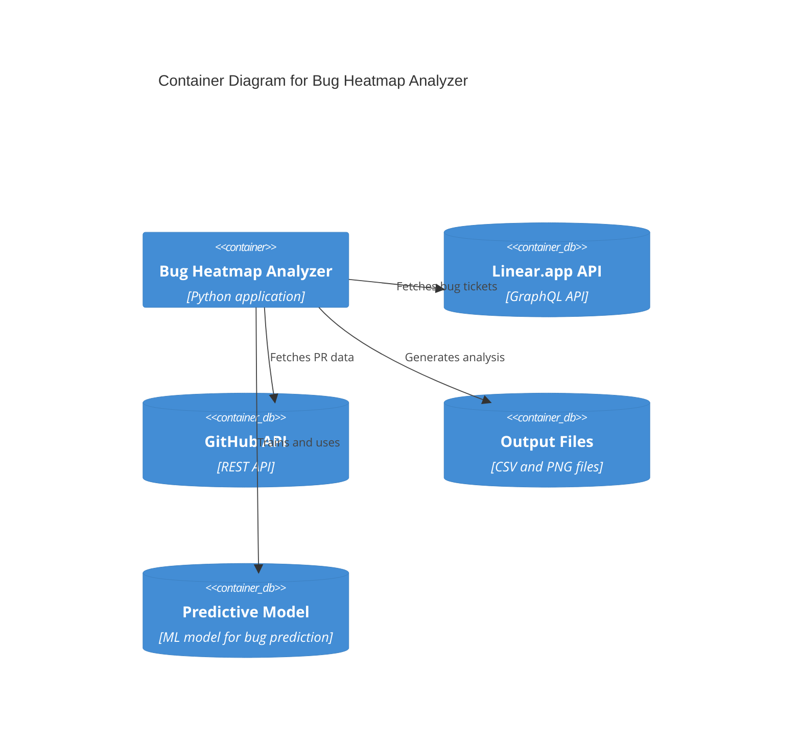

# Bug Heatmap Analyzer

This project analyzes bug tickets from Linear.app and correlates them with GitHub pull requests to generate a heatmap of bug-prone files, and predicts the likelihood of bugs in new pull requests.

## System Architecture




## Technical Design

### System Requirements
- Python 3.8+
- Linear.app API access
- GitHub API access
- Sufficient storage for analysis output
- Scikit-learn for predictive modeling
- Pandas for data analysis

### Data Flow
1. Linear.app API → Bug tickets with branch names
2. GitHub API → Pull request data for each branch
3. Local processing → File change analysis
4. Output generation → CSV and visualization files
5. Model training → Predictive analysis for new PRs

### Predictive Analysis
The system uses historical data to predict the likelihood of bugs in new pull requests by analyzing:

1. **File-based Features**
   - Historical bug frequency per file
   - File complexity metrics
   - File change frequency
   - File ownership patterns

2. **PR-based Features**
   - Number of files changed
   - Lines of code changed
   - Time of day/week
   - Author's historical bug rate
   - Review patterns

3. **Code-based Features**
   - Code complexity metrics
   - Test coverage
   - Dependency changes
   - Code review comments

4. **Model Output**
   - Confidence score (0-100%)
   - Risk factors identified
   - Recommended actions
   - Historical comparisons

### Error Handling
- API rate limiting
- Network connectivity issues
- Missing or invalid data
- File system permissions
- Model training failures

### Performance Considerations
- Batch processing of tickets
- Caching of API responses
- Memory management for large datasets
- Parallel processing capabilities

### Security
- API key management
- Data privacy
- Output file permissions
- Network security

### Monitoring and Logging
- API call tracking
- Error logging
- Performance metrics
- Analysis progress

### Testing Strategy
- Unit tests for each component
- Integration tests for API interactions
- End-to-end testing
- Performance testing

### Deployment
- Environment setup
- Dependency management
- Configuration management
- Update procedures

### Maintenance
- Regular updates
- Bug fixes
- Performance optimization
- Documentation updates

## Features

- Fetches bug tickets from Linear.app
- Associates tickets with GitHub pull requests
- Analyzes files changed in pull requests
- Generates a heatmap showing which files are most prone to bugs

## Setup

1. Install dependencies:
```bash
pip install -r requirements.txt
```

2. Create a `.env` file with your API keys:
```
LINEAR_API_KEY=your_linear_api_key
GITHUB_TOKEN=your_github_token
```

3. Run the analysis:
```bash
python main.py
```

## Configuration

- Update `config.py` to customize:
  - Linear team ID
  - GitHub repository details
  - Analysis parameters

## Output

The analysis generates:
- A CSV file with bug ticket and PR associations
- A heatmap visualization of bug-prone files
- Summary statistics of bug distribution

## System Components

1. **Linear Client** (`linear_client.py`)
   - Handles communication with Linear.app's GraphQL API
   - Fetches bug tickets and associated metadata

2. **GitHub Client** (`github_client.py`)
   - Manages interaction with GitHub's REST API
   - Retrieves pull request data and file changes

3. **Bug Analyzer** (`analyzer.py`)
   - Processes and correlates data from both systems
   - Generates visualizations and analysis reports

4. **Predictive Model** (`predictive_model.py`)
   - Trains on historical bug data
   - Generates confidence scores for new PRs
   - Identifies risk factors
   - Provides recommendations

5. **Main Application** (`main.py`)
   - Orchestrates the entire analysis process
   - Coordinates between different components

## Future Enhancements
- Support for multiple repositories
- Advanced filtering options
- Custom visualization types
- Automated reporting
- Integration with CI/CD pipelines
- Real-time PR risk assessment
- Automated code review suggestions
- Team performance metrics
- Bug prediction accuracy improvements

## Troubleshooting
- Common issues and solutions
- Debugging procedures
- Support contact information

## Contributing
- Code style guidelines
- Pull request process
- Testing requirements
- Documentation standards