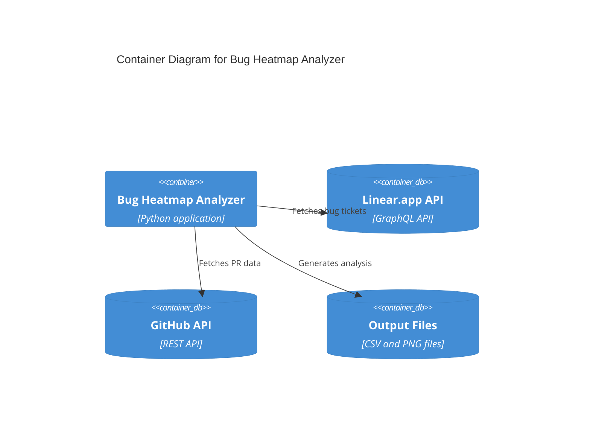

# Bug Heatmap Analyzer

This project analyzes bug tickets from Linear.app and correlates them with GitHub pull requests to generate a heatmap of bug-prone files.

## System Architecture




## Features

- Fetches bug tickets from Linear.app
- Associates tickets with GitHub pull requests
- Analyzes files changed in pull requests
- Generates a heatmap showing which files are most prone to bugs

## Setup

1. Install dependencies:
```bash
pip install -r requirements.txt
```

2. Create a `.env` file with your API keys:
```
LINEAR_API_KEY=your_linear_api_key
GITHUB_TOKEN=your_github_token
```

3. Run the analysis:
```bash
python main.py
```

## Configuration

- Update `config.py` to customize:
  - Linear team ID
  - GitHub repository details
  - Analysis parameters

## Output

The analysis generates:
- A CSV file with bug ticket and PR associations
- A heatmap visualization of bug-prone files
- Summary statistics of bug distribution

## System Components

1. **Linear Client** (`linear_client.py`)
   - Handles communication with Linear.app's GraphQL API
   - Fetches bug tickets and associated metadata

2. **GitHub Client** (`github_client.py`)
   - Manages interaction with GitHub's REST API
   - Retrieves pull request data and file changes

3. **Bug Analyzer** (`analyzer.py`)
   - Processes and correlates data from both systems
   - Generates visualizations and analysis reports

4. **Main Application** (`main.py`)
   - Orchestrates the entire analysis process
   - Coordinates between different components